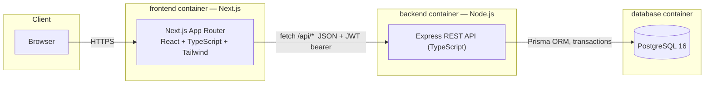
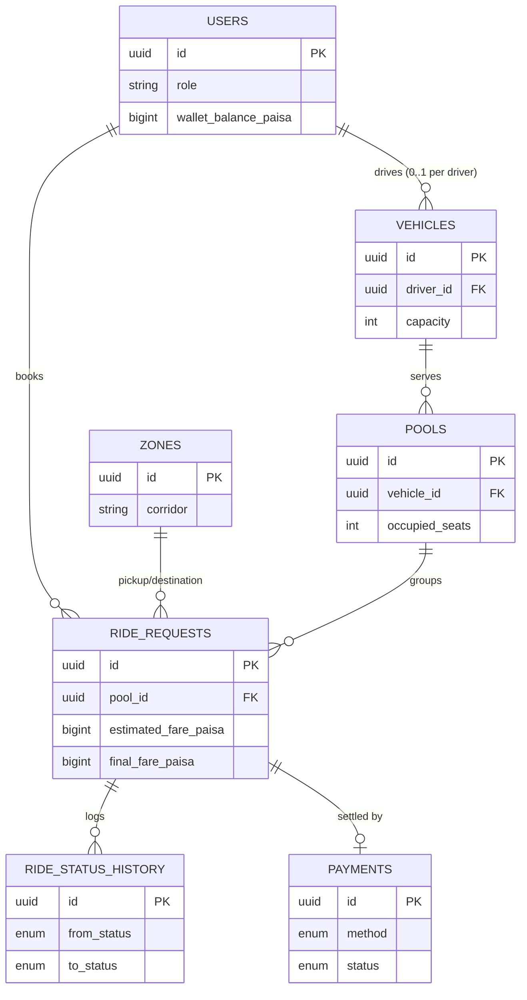

# Dhaka Tesla Pool

Share a seat. Split the fare. Survive Dhaka traffic.

A ride-pooling MVP built for the RoBenDevs internship take-home challenge: passengers request a ride between predefined Dhaka zones, compatible requests get pooled onto the same three-wheeler ("Tesla") automatically, drivers run the trip through its full lifecycle, and fares are calculated per passenger with a pooling discount. Built around a small recurring cast — driver **Jashim** and his Tesla **Bullet**, passengers **Nusrat**, **Rafiq**, and **Shirin** — the same way the original brief tells its own story.

## Summary

The product problem, in one paragraph: Nusrat wants to get from Banani to Mohakhali; two minutes later, Rafiq books an overlapping-but-not-identical trip from the same pickup zone. The system has to decide, fast, whether these two total strangers can share Bullet's three seats, split the fare fairly, and both end up with an accurate picture of who's in the vehicle and what happens next. That's the whole MVP: a **Passenger** who can request/track/cancel a ride, a **Driver** who can go online, see relevant requests, and run a trip through its stages, and a **Pool** layer in between that decides who can share a seat and makes sure a vehicle's capacity is never exceeded — even when two passengers try to claim the same last seat at the same instant.

## Features implemented

**Passenger**
- Sign up / log in (JWT-based)
- Request a ride (pickup zone, destination zone, seat count, cash or simulated TeslaPay)
- See an estimated fare at request time
- Track ride status live (polling): waiting → matched → driver arrived → in progress → completed
- View ride history with final fare once completed
- Cancel a ride while it's still cancellable

**Driver**
- Sign up together with their vehicle (name + seat capacity) / log in
- Go online (declaring a current zone) / go offline (blocked while a trip is in progress)
- See pending requests relevant to their current zone
- Accept a request — capacity-safe, even under concurrent load (see below)
- Mark arrived → start trip → complete trip, cascading to every pooled passenger at once
- Fare is finalized on completion, with the pooling discount applied only when 2+ passengers actually shared the ride
- View ride history (past completed trips, per passenger and fare)

**Pooling / matching**
- Same-pickup-zone + compatible-destination-corridor rule (documented, not a real routing engine — see [docs/decisions.md](docs/decisions.md#matching-rule))
- A vehicle can only ever be serving one active trip at a time
- Seat capacity is enforced atomically at the database level — proven with an automated test that fires two concurrent "accept" requests at Bullet's last seat and asserts exactly one wins (see [How to run tests](#how-to-run-tests))

**Money**
- Every amount is stored and computed as an integer paisa count, never a float (see [docs/decisions.md](docs/decisions.md#why-money-is-stored-as-integer-paisa-not-decimalfloat))
- Full audit trail: every status change is recorded with who triggered it and when

Screenshots/GIFs and the demo video walkthrough will be added together — see the [Demo video](#demo-video) section.

## Architecture



Full diagram, layering, and the reasoning behind every piece: **[docs/architecture.md](docs/architecture.md)**.

## Data model (ERD)



Full field list, constraints, and indexes: **[docs/erd.md](docs/erd.md)**.

## Tech stack

| Layer | Choice | Why (short version) |
|---|---|---|
| Frontend | Next.js 16 (App Router), TypeScript, Tailwind CSS v4 | PRD-recommended; App Router's file-based routing fit the passenger/driver split without a separate router library |
| Backend | Node.js, Express 5, TypeScript | Full control over the transaction boundaries the concurrency fix needs, without a framework's request lifecycle in the way |
| Database | PostgreSQL 16 (via Docker), Prisma ORM | Relational by nature (capacity constraints, foreign keys); Postgres's MVCC is what makes the capacity-safe `UPDATE` correct, not just accidentally-safe |
| Auth | JWT (bearer token), bcryptjs | Stateless, no shared session store to scale; `bcryptjs` over native `bcrypt` to avoid a C++ build toolchain dependency |
| Validation | Zod | Schema *is* the TypeScript type — one definition, not two that can drift |
| Testing | Jest + Supertest, plus PGlite for a real (not mocked) ephemeral database in CI | See [How to run tests](#how-to-run-tests) |

Every one of these has a full write-up — what was picked, the real alternatives, why, and what would change the answer later — in **[docs/tech-justifications.md](docs/tech-justifications.md)**.

## Project structure

```
.
├── backend/
│   ├── prisma/
│   │   ├── schema.prisma          # data model (source of truth, matches docs/erd.md)
│   │   ├── migrations/            # applied via `prisma migrate deploy`
│   │   └── seed.ts                # story-cast seed data (Jashim/Bullet, Nusrat, Rafiq, Shirin)
│   ├── scripts/dev-db.ts          # local-only ephemeral Postgres for dev without Docker
│   ├── src/
│   │   ├── app.ts                 # Express app, middleware, route mounting
│   │   ├── index.ts                # entrypoint
│   │   ├── config/, lib/, middleware/, types/
│   │   ├── modules/
│   │   │   ├── auth/               # signup, login, /me
│   │   │   ├── zones/               # predefined Dhaka zone list
│   │   │   ├── rides/               # request/list/cancel, fare calculation
│   │   │   └── driver/              # status, relevant requests, accept, lifecycle
│   │   └── test/                    # the real-database test harness (db.ts) + jest setup
│   └── Dockerfile
├── frontend/
│   ├── app/
│   │   ├── login/, signup/          # auth pages
│   │   ├── passenger/                # request-a-ride dashboard
│   │   └── driver/                   # online/offline + accept + lifecycle dashboard
│   ├── lib/                          # API client, auth context, shared types
│   ├── components/                   # small shared UI (FormField, StatusBadge)
│   └── Dockerfile
├── docs/                              # architecture, ERD, decisions, tech justifications, scaling
├── docker-compose.yml
└── README.md                          # this file
```

## Prerequisites

- [Docker](https://www.docker.com/) and Docker Compose (recommended path — see [Docker setup](#docker-setup))
- Or, for local (non-Docker) dev: Node.js 20+, npm, and a running PostgreSQL instance

## Environment variables

Never commit a real `.env` file — `.gitignore` already excludes them, and `.env.example` files (safe to commit) exist at the root of each service:

**`backend/.env.example`**
| Variable | Meaning |
|---|---|
| `DATABASE_URL` | Postgres connection string |
| `JWT_SECRET` | Symmetric secret used to sign JWTs — generate a real random value for any real deployment |
| `JWT_EXPIRES_IN` | Token lifetime (e.g. `1d`) |
| `PORT` | Port the API listens on |

**`frontend/.env.example`**
| Variable | Meaning |
|---|---|
| `NEXT_PUBLIC_API_URL` | Where the frontend calls the backend. Read by the **browser**, so it must be inlined at build time (see [docs/architecture.md](docs/architecture.md#environments)) — not a Docker-internal hostname. |

## Docker setup

The straightforward path — one command brings up Postgres, the API, and the frontend, migrated and seeded automatically:

```bash
docker compose up --build
```

- Frontend: [http://localhost:3000](http://localhost:3000)
- Backend API: [http://localhost:4000](http://localhost:4000) (health check at `/health`)
- The backend container runs `prisma migrate deploy`, then seeds the story cast, then starts the server — every time it starts, safely (seeding is idempotent).

## Local setup (without Docker)

```bash
# Backend
cd backend
npm install
cp .env.example .env        # point DATABASE_URL at any Postgres you have
                             # (no Postgres handy? npm run dev:db starts a throwaway one)
npx prisma migrate deploy
npm run build && npm run prisma:seed   # or: npm run prisma:seed:dev (faster, no build step)
npm run dev                 # http://localhost:4000

# Frontend, in a second terminal
cd frontend
npm install
cp .env.example .env.local  # point NEXT_PUBLIC_API_URL at the backend above
npm run dev                 # http://localhost:3000
```

## Migrations & seed data

- `npx prisma migrate deploy` (backend/) applies every migration in `backend/prisma/migrations/` in order — including the partial unique index that prevents a vehicle from ever serving two active pools at once (see [docs/decisions.md](docs/decisions.md#concurrency)).
- `npm run prisma:seed` seeds the zones (with their pooling corridors) and the story cast. It's an upsert-based script, safe to run more than once.

## Demo credentials

Every seeded account uses the same password: **`TeslaPool123!`**

| Role | Email | Notes |
|---|---|---|
| Driver | `jashim@dhakateslapool.test` | Owns Bullet (3 seats), seeded already `ONLINE` at Banani |
| Passenger | `nusrat@dhakateslapool.test` | |
| Passenger | `rafiq@dhakateslapool.test` | |
| Passenger | `shirin@dhakateslapool.test` | |

Seeded zones (with their pooling corridor in parentheses): Banani, Gulshan 1, Gulshan 2, Mohakhali, Bashundhara (`gulshan_banani`); Dhanmondi, Farmgate (`central`); Mirpur, Uttara (`north`).

## How to run tests

```bash
cd backend
npm test
```

27 tests across 6 suites — unit tests for the pure fare/JWT logic, and integration tests that run the real Express app against an ephemeral, real Postgres-wire-protocol database (no mocks). Covers, among other things:

- The PRD's named concurrency scenario verbatim: Bullet has 1 seat left, two passengers race for it — exactly one gets `200`, the other `409`, and `occupied_seats` never exceeds `capacity`
- The matching rule (pool despite different destinations when corridors match; reject when they don't)
- A passenger can't cancel or view another passenger's ride
- Fare finalization matches the hand-verified numbers below exactly

There's no Docker daemon in the environment this was built in, so `docker compose up` itself hasn't been run end-to-end there. What was verified instead: the compose YAML parses correctly, and the exact commands the container runs on startup (`prisma migrate deploy`, then the compiled seed script) were run successfully against a `node_modules` containing only the production dependencies — the same dependency set the built image would actually ship. Still worth running `docker compose up` for real at least once before treating Docker packaging as fully proven.

## Fare model (hand-verifiable)

```
passengerFare = baseFare + distanceCharge − poolDiscount
baseFare = 2,500 paisa (৳25.00)
distanceCharge = round(distanceKm × 1,500 paisa/km)
poolDiscount = 20% of (baseFare + distanceCharge), only if 2+ passengers actually pooled
```

| Passenger | Trip | Distance | Pooled fare |
|---|---|---:|---:|
| Nusrat | Banani → Mohakhali | 1.521 km | **৳38.25** |
| Rafiq | Banani → Gulshan 1 | 1.630 km | **৳39.55** |

Full derivation (and why money is integer paisa, not a float): [docs/decisions.md](docs/decisions.md#fare-model).

## API overview

All routes except `/health` and `/api/auth/*` require `Authorization: Bearer <token>`.

| Method | Path | Who | Purpose |
|---|---|---|---|
| POST | `/api/auth/signup` | anyone | Create a passenger or driver account (+ vehicle, for drivers) |
| POST | `/api/auth/login` | anyone | Get a JWT |
| GET | `/api/auth/me` | either | Current user |
| GET | `/api/zones` | either | Predefined zone list |
| POST | `/api/rides` | passenger | Request a ride |
| GET | `/api/rides` | passenger | My ride history |
| POST | `/api/rides/:id/cancel` | passenger | Cancel my own ride |
| PATCH | `/api/driver/status` | driver | Go online (+ zone) / offline |
| GET | `/api/driver/dashboard` | driver | My vehicle + active pool state |
| GET | `/api/driver/requests` | driver | Pending requests at my current zone |
| GET | `/api/driver/history` | driver | My past completed trips |
| POST | `/api/driver/requests/:id/accept` | driver | Accept a request (capacity-safe) |
| POST | `/api/driver/pool/arrived` \| `/start` \| `/complete` | driver | Advance the active trip's lifecycle |

## Key decisions & trade-offs

The PRD deliberately leaves parts of the spec open (Section 17). Every assumption made here is documented, not just implemented silently — the full reasoning for each is in **[docs/decisions.md](docs/decisions.md)**:

- The matching rule (same pickup zone + compatible destination corridor)
- Why `MATCHED` and `ACCEPTED` are one combined lifecycle state, not two
- The exact concurrency fix (a single conditional `UPDATE`, not a read-then-write) — and a *second* race this same principle also had to close, found while building it, not anticipated upfront
- Why money is integer paisa
- Why a driver's vehicle is created together with their account (one vehicle per driver)

## Known limitations

- **No real routing** — distances are haversine (straight-line), zones are a fixed list, exactly as the PRD asks for (Section 3: "you do not need to solve real routing")
- **No low-balance decline for TeslaPay** — the simulated wallet can go negative; a real decline/retry flow is out of MVP scope (documented assumption, not an oversight)
- **Polling, not push** — the frontend polls every 4 seconds rather than using a WebSocket/SSE connection; deliberate, see [docs/tech-justifications.md](docs/tech-justifications.md)
- **One vehicle per driver** — no fleet/shift model; see [docs/decisions.md](docs/decisions.md#one-vehicle-per-driver)
- **`docker compose up` not run end-to-end in this dev environment** — see [How to run tests](#how-to-run-tests)

## Next improvements

- A ratings/review table (schema note in [docs/erd.md](docs/erd.md) already anticipates this)
- Real geospatial matching instead of the static zone/corridor list (see [docs/scaling.md](docs/scaling.md))
- WebSocket/SSE push instead of polling, once update volume justifies it
- The full "if it goes viral" scaling path: [docs/scaling.md](docs/scaling.md)

## AI usage

Claude (Claude Code) was used throughout this build — architecture and ERD design, backend and frontend implementation, test design, and this documentation. Disclosed here per Section 8, not hidden:

- **Tools used**: Claude Code, for design, implementation, debugging, and documentation, end to end.
- **One accepted suggestion**: the atomic conditional-`UPDATE` pattern for seat capacity (`WHERE occupied_seats + n <= capacity`) instead of a `SELECT ... FOR UPDATE` row lock — simpler, needs no explicit locking, and Postgres's own MVCC guarantees correctness. Verified directly against a real Postgres-wire-protocol engine before trusting it (see [docs/decisions.md](docs/decisions.md#concurrency)).
- **One rejected/changed suggestion**: Prisma's newest major version (7.x) was initially installed by default, but it turned out to ship a completely different cloud-platform CLI (hosted "Postgres branches per git branch") instead of the classic self-hosted `migrate`/`generate` workflow this PRD's plain Docker-Compose deployment actually needs. Pinned to the 6.x line instead, with the reasoning recorded in [docs/tech-justifications.md](docs/tech-justifications.md) — a case of *not* taking the default suggestion once it turned out not to fit.

Ownership means being able to explain, debug, redesign, or change any of this live — that's the standard this was held to throughout, not "did AI write it."

## Deployment URL

Not yet deployed. Docker packaging (see above) is deployment-ready; a live URL will be added here once deployed to a free-tier host.

## Demo video

Not yet recorded. Will be linked here (max 6 minutes, structured per the PRD: problem understanding, engineering walkthrough, product tour) once recorded.
