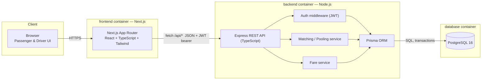

# Architecture

## System diagram



Three containers, wired by `docker-compose.yml`: `frontend`, `backend`, `db`. The frontend never talks to Postgres directly — every read/write goes through the backend's REST API, which is the only thing that holds the Prisma client and the DB credentials.

## Why this shape

- **Next.js (App Router) frontend** — mandated-or-React choice; App Router gets server components for the initial dashboard load (fewer client-side waterfalls) and file-based routing for the passenger/driver split, without needing a separate router library.
- **Node.js + Express backend, not NestJS** — Express, NestJS and Fastify were all allowed (Section 6). NestJS's module/DI/decorator ceremony is a better fit once a team and a large surface area exist; for a single-developer MVP on a deadline it adds indirection without buying much. Express gives direct control over transaction boundaries, which matters specifically for the seat-capacity race (see [decisions.md](decisions.md#concurrency)) — the atomic update is easier to reason about without a framework's request lifecycle wrapping it. Fastify was the closest runner-up (better raw throughput) but Express's ecosystem/maturity made it the safer choice to implement correctly under time pressure. If this grew past MVP into a multi-team codebase, NestJS is what I'd switch to (Section 7).
- **PostgreSQL via Prisma** — relational, because the domain is relational: vehicles have capacity, pools have members, requests reference users and zones with real foreign-key constraints that must hold (e.g. occupied seats can never exceed vehicle capacity). Prisma gives migrations, a typed client, and `$transaction` for the capacity-safe writes. MySQL and SQLite were the other PRD-sanctioned options; SQLite was ruled out for anything beyond local scripting because its single-writer model works against the exact concurrent-write problem (Section 12) this app needs to demonstrate solving correctly; MySQL was a close alternative to Postgres but Postgres's stricter typing, native `CHECK` constraints and better JSON/enum support made it the pick.
- **No microservices, queues, Kafka, Redis** — explicitly told not to (Section 9). A single backend process talking to one Postgres instance is enough for the actor/traffic scale this MVP targets; see [decisions.md](decisions.md#viral-scale-bonus) for what would actually be needed at 1M passengers / 100k drivers.

## Request/response shape

REST over JSON, JWT bearer auth (`Authorization: Bearer <token>`), stateless — no server-side session store, so the backend can scale horizontally without sticky sessions. GraphQL was considered and rejected: the client's data needs here are simple CRUD-shaped (a handful of fixed views: my active ride, my history, driver's relevant requests), not the deeply nested/variable queries GraphQL earns its complexity on.

## Layering inside the backend

```
routes  →  controllers  →  services  →  Prisma (repository access)
                               ↑
                          zod schemas (request validation)
```

- **Routes** — wire HTTP verbs/paths to controllers, apply `requireAuth`/`requireRole` middleware.
- **Controllers** — parse/validate the request (zod), call a service, shape the HTTP response. No business logic.
- **Services** — all business rules live here: matching/pooling, capacity enforcement, fare calculation, state-transition legality. Framework-agnostic — could be lifted into a different HTTP layer unchanged.
- **Prisma** — the only place that knows SQL/schema shape.

This keeps "where does the business logic live" (an explicit grading point in Section 6) unambiguous: it's always in `src/modules/*/*.service.ts`, never in a route handler.

## Environments

| Environment | Frontend | Backend | Database |
|---|---|---|---|
| Local dev (no Docker) | `npm run dev` (Next dev server) | `npm run dev` (ts-node-dev) | `npm run dev:db` — the project's own PGlite engine (see [README](../README.md#local-setup-without-docker)) on a fixed local port, or `DATABASE_URL` pointed at any real Postgres |
| `docker compose up` | container, built from `frontend/Dockerfile` | container, built from `backend/Dockerfile` | `postgres:16-alpine` container with a named volume |
| Tests (`npm test` in `backend/`) | — | same Express app, imported directly (supertest) | ephemeral in-process Postgres-compatible engine ([PGlite](https://pglite.dev)), migrated fresh per test run — see [README testing section](../README.md#testing) for why |

The same Prisma schema and migrations run unmodified against all three; only `DATABASE_URL` changes.

**One frontend-specific gotcha worth calling out**: `NEXT_PUBLIC_API_URL` is read by the *browser*, not by the frontend container, so it gets inlined into the client JavaScript bundle at `next build` time (Next.js's own docs call this out explicitly) — a `docker-compose environment:` entry would have zero effect on it, since by then the image is already built. `frontend/Dockerfile` takes it as a build `ARG` instead, and `docker-compose.yml` sets that arg to `http://localhost:4000` — the backend's *host-published* port, not a Docker-internal service name like `http://backend:4000`, which the user's browser has no way to resolve.
