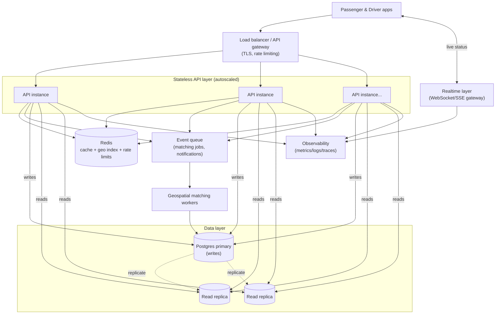

# Bonus: "If Oi Tesla Goes Viral" — scaling to 1M passengers / 100k drivers

This is reasoning, not implementation — the MVP intentionally stays a single backend + single Postgres instance (Section 9: don't add complexity without a reason). This is what I'd actually change, and in what order, if usage grew by three orders of magnitude.

## Target diagram

## Load balancing & horizontal scaling

The backend is already stateless (JWT, no server-side session) — that's what makes this step cheap. Put a load balancer / API gateway in front of N identical API containers behind autoscaling (CPU/RPS-based). Nothing in the request path assumes "this instance" holds state in memory, so scaling out is just adding instances.

## Database: indexing, read replicas, contention

- **Indexing** — the MVP already indexes `ride_requests(status, pickup_zone_id)` and `pools(vehicle_id, status)`; at scale these need to be revisited with real query plans (`EXPLAIN ANALYZE`) rather than guessed, and probably partitioned (e.g. `ride_requests` partitioned by month) once history tables get large.
- **Read replicas** — dashboards, ride history, and "see relevant requests" listings are read-heavy and tolerate slight staleness; route those to replicas, keep the seat-reservation write (the one place correctness is non-negotiable) on the primary.
- **DB contention** — the MVP's conditional `UPDATE` on `pools.occupied_seats` (see [decisions.md](decisions.md#concurrency)) is safe but becomes a hot-row bottleneck if one pool receives very high concurrent accept-traffic. Fix: shard the "who gets the next seat" decision per-vehicle through a single-threaded in-memory sequencer (Redis `WATCH`/`MULTI`, or a per-vehicle actor/queue) so Postgres only ever receives the already-resolved winning write — Postgres stays the durable source of truth, it just stops being the place contention is resolved.

## Caching

Redis for: the zone list and corridor table (near-static, read on every match attempt), a driver's current online/offline + capacity snapshot (read far more than written), and rate-limit counters. Ride state itself is not cached — it's exactly the data that must never be stale, so it's always read from Postgres (replica for display, primary for the accept path).

## Geospatial search

The MVP's "zone + corridor" matching is a placeholder for real geospatial matching. At scale: store driver live locations in a geo-indexed store (Redis `GEOADD`/`GEOSEARCH`, or Postgres + PostGIS if it should stay in the relational store) and match on proximity radius + route overlap instead of static zones — the zone table becomes a fallback/display concept rather than the matching key.

## Queues / events, real-time communication

- **Queues** — matching is currently synchronous (one HTTP request does the whole accept). At scale, decouple: a ride request publishes a "find me a pool" event; a pool of matching workers consumes it, so a burst of 10,000 simultaneous requests doesn't turn into 10,000 simultaneous long-held DB transactions on the API tier.
- **Real-time** — the MVP's frontend polls for status changes, which is fine at MVP scale and explicitly avoids adding infrastructure "just to look advanced" (Section 9). At scale, polling from hundreds of thousands of open dashboards is wasteful; switch passenger/driver status updates to a WebSocket or SSE gateway that pushes on state change instead.

## Rate limiting & idempotency

- **Rate limiting** at the gateway (per-user and per-IP) — cheap insurance against a buggy client retry-looping the accept endpoint.
- **Idempotency keys** on write endpoints that a client might retry (especially "accept a ride" and "complete trip") — a client-generated idempotency key stored against the request means a network-retry can't double-charge a fare or double-accept a seat, which matters much more once retries are automatic/expected at scale rather than a rare edge case.

## Ride matching at scale

The MVP's synchronous, zone-based matching is O(pending requests for this zone) per accept — fine at MVP volume. At scale this becomes an actual assignment-optimization problem (batch passengers in a time/geo window, solve for vehicle assignment that minimizes total detour, similar in shape to real dispatch systems) run by the geospatial matching workers above, publishing "matched" events rather than answering inline in the HTTP request.

## Retry / failure strategy

Every external side effect (payment settlement, push notification, matching event) should be retried with exponential backoff and a dead-letter queue for whatever still fails after N attempts, rather than silently dropped or blocking the request that triggered it. The seat-reservation write itself deliberately stays synchronous and un-retried from the client's perspective — a failed reservation should fail fast and clearly (`409`), not retry into a race.

## Observability

Structured logs with a request/correlation ID that follows a ride request through its whole lifecycle (request → match → accept → arrive → start → complete), metrics on match latency / accept success-vs-conflict rate / pool fill rate, and traces across the API → queue → matching-worker → DB path — mostly to make the exact concurrency scenario this challenge asks about (Section 12) *observable* in production, not just correct in a test.

## Security at scale

Same JWT-based auth, but: short-lived access tokens + refresh tokens instead of one long-lived token, per-endpoint rate limits, audit logging on every state-changing action (the MVP's `ride_status_history` table is already this, just not yet shipped anywhere for alerting), and secrets in a managed secret store instead of `.env` files.

## Deployment strategy

Containers stay the deployment unit (already true in the MVP), but move from one Compose file to an orchestrator (ECS/Kubernetes) with rolling deploys, health-check-gated traffic cutover, and separate autoscaling policies for the API tier vs. the matching-worker tier, since they have different load shapes (API scales with request volume, workers scale with pending-match backlog).

---

**Reasoning over box-count**: none of the above is implemented in the MVP, and it shouldn't be — a queue, a cache, and three replicas for three seed passengers would be exactly the over-engineering Section 9 and Section 16 warn against. The point of this document is to show the shape of the next step is understood, not to pre-build it.
